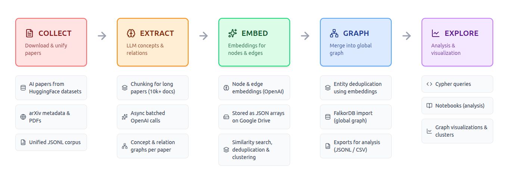
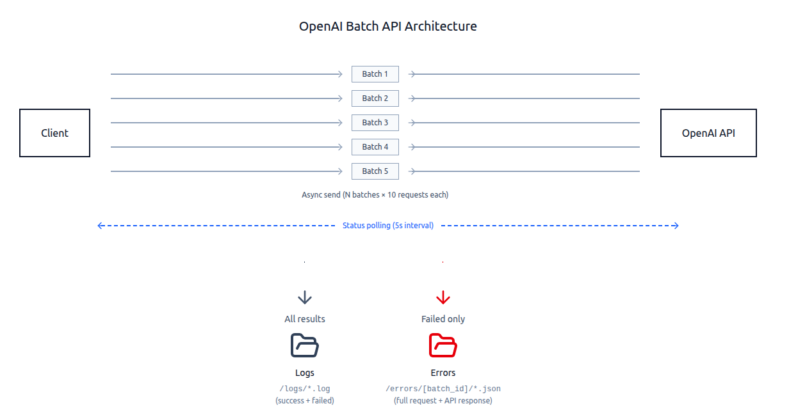

# AI Safety Scientific Literature Knowledge Extraction

This repository contains all results created as part of the Eleuther AI Summer of Open AI Research 2025 program for project #5: "Scientific Literature Knowledge Extraction Tool".

## About the Project

The project aims to automatically extract structured knowledge from AI Safety scientific literature and build a Knowledge Graph that connects concepts, methods, and interventions from different research papers.

---

## Data is Ready — Time for Research!

**All data processing is complete.** We have built a comprehensive knowledge graph from [**Alignment Research Dataset**](https://huggingface.co/datasets/StampyAI/alignment-research-dataset) — a curated collection of AI Safety research from HuggingFace.

### What We Have

**Global Knowledge Graph** connecting concepts, interventions, and research ideas across **11,800 AI Safety papers**:

**Graph Structure:**
- **Concepts** — risks, methods, ideas, and research directions extracted from papers
- **Interventions** — proposed solutions and mitigation strategies
- **Relationships** — how concepts connect across different papers (caused_by, mitigated_by, validated_by, etc.)
- **Semantic embeddings** — vector representations enabling similarity search and concept clustering
- *[More details and statistics](#processing-statistics)*

### Ready-to-Use Formats

The knowledge graph is available in three formats:

1. **CSV Tables** — Easy analysis in Excel, pandas, R
   - 📁 [Download CSV Export](https://drive.google.com/drive/u/0/folders/1zwJ0RnixYV9NW8l8QHPsslORDrAzgXlG)

2. **JSON Graph** — For custom scripts and NetworkX analysis
   - 📁 [Download graph.json](https://drive.google.com/drive/u/0/folders/1RPbETx21KMyEATtVOBt8LOClVd56eZ4x)

3. **FalkorDB Database** — Interactive queries with vector search
   - 📁 [Download FalkorDB dumps](https://drive.google.com/drive/u/0/folders/1y_Q3Ti4nBlUG0l51hGqc0rDID88jbtGw)
   - Requires: Docker, 8GB+ RAM, 20GB+ disk space
   - See [Stage 4](#stage-4-merging-into-global-graph-falkordb) for setup instructions

### Next Step: Explore the Graph

**For Researchers:** 🔬 Jump to [Stage 5: Analysis and Research](#stage-5-analysis-and-research-of-results) to start working with the data.

**For Developers:** 💻 Start with [Pipeline Architecture](#pipeline-architecture) to understand the system, review [Stages 1-4](#stage-1-raw-data-loading) for implementation details, then see [Development Setup](#development-setup) to contribute.

---

## Table of Contents

- [Pipeline Architecture](#pipeline-architecture)
- [Stage 1: Raw Data Loading](#stage-1-raw-data-loading)
- [Stage 2: Local Graph Extraction](#stage-2-local-graph-extraction)
- [Stage 3: Embeddings Computation](#stage-3-embeddings-computation)
- [Stage 4: Merging into Global Graph (FalkorDB)](#stage-4-merging-into-global-graph-falkordb)
- [Processing Statistics](#processing-statistics)
- [Development Setup](#development-setup)
- [Stage 5: Analysis and Research of Results](#stage-5-analysis-and-research-of-results)
- [Possible Future Projects](#possible-future-projects-based-on-knowledge-graph)

## Pipeline Architecture

*The sections below describe how this knowledge graph was created. This is useful for understanding the data processing pipeline, contributing to the codebase, or replicating the process on new data.*

The system operates in 5 stages:


*Figure 1: Five-stage pipeline from raw papers to knowledge graph (Stages 1-4 complete)*

**Stage 1: Raw Data Loading**
- Load articles from HuggingFace dataset
- Convert to unified format
- Deduplication by arXiv ID and title

**Stage 2: Local Graph Extraction**
- Process each article using LLM (OpenAI API)
- Extract concepts (nodes) and relationships (edges)
- Save local graphs in specialized format
- Additional static validation of LLM results
- Additional dynamic validation with LLM Judge

**Stage 3: Embeddings Computation**
- Generate vector representations for each node and edge
- Use OpenAI Embeddings API
- Save embeddings for semantic search and clustering

**Stage 4: Merging into Global Graph**
- Load all local graphs into FalkorDB
- Merge identical concepts based on embeddings
- Build global knowledge graph
- Export global graph to JSON format

**Stage 5: Results Analysis**
- Knowledge graph visualization
- Semantic similarity search
- Cluster and pattern analysis

---

## Stage 1: Raw Data Loading

**Directory**: `./intervention_graph_creation/src/data_interfaces/`

### About the Dataset

We use [**Alignment Research Dataset**](https://huggingface.co/datasets/StampyAI/alignment-research-dataset) from StampyAI — a large curated dataset on AI Safety and AI Alignment research.

**Data Sources:**
- **ArXiv** — AI Safety research papers
- **Alignment Forum** — technical discussion of alignment problems
- **LessWrong** — selected posts
- **Distill** — interactive ML articles
- **Arbital** — AI Safety wiki
- **EA Forum** — effective altruism
- **Researcher blogs**: MIRI, DeepMind Safety, Anthropic, OpenAI Research, and others
- **YouTube channels**: Rob Miles AI, AI Safety talks, and others

**Record Structure:**
```python
{
    "id": "unique identifier",
    "source": "arxiv | lesswrong | alignmentforum | ...",
    "title": "article title",
    "authors": ["list", "of", "authors"],
    "text": "full article text",
    "url": "link to original",
    "date_published": "2023-01-15T00:00:00Z"  # UTC format
}
```

**Size**: 15K documents, English language

### Configuration

The `config.yaml` file contains all paths and parameters:

```yaml
paths:
  input_dir: "./intervention_graph_creation/data/raw/ard_json"
```

### Usage

```bash
# Load data from HuggingFace
uv run python -m intervention_graph_creation.src.data_interfaces.ard_json_loader
```

Data will be downloaded and saved to the directory specified in `config.yaml` (`paths.input_dir`).

---

## Stage 2: Local Graph Extraction

**Directory**: `./intervention_graph_creation/src/local_graph_extraction/extract`

### Process Description

At this stage, each article is processed using LLM (OpenAI API) to extract a structured knowledge graph:

- **Nodes** — concepts, ideas, methods, risks, interventions from the article
- **Edges** — relationships between concepts (e.g.: "caused_by", "mitigated_by", "validated_by")

The LLM receives the full article text and a special prompt (`PROMPT_EXTRACT`) that instructs the model to identify all cause-and-effect chains from risks to proposed interventions.

### Processing Architecture


*Figure 2: Asynchronous batch processing with OpenAI API — polling mechanism, parallel execution, and automatic error handling*

**Key Features:**

1. **Asynchronous Processing + Batches**
   - Articles are grouped into batches (default 10 articles)
   - Batches are sent to OpenAI Batch API asynchronously
   - Support for parallel processing of multiple batches

2. **Polling Mechanism**
   - Periodic polling of batch status (every 60 seconds)
   - Processing progress logging
   - Automatic retrieval of results upon completion

3. **Error Handling**
   - Articles with errors are automatically moved to `extraction_error_dir`
   - Error context saved for debugging
   - Continue processing remaining articles

4. **Results Validation**
   - Automatic validation of JSON response structure
   - Validation of required fields (nodes, edges)
   - Additional post-processing using `extra_validation.py` script:
     - Check for minimum 3 files in article folder
     - Check existence of JSON file with correct name
     - Validate that nodes and edges arrays are not empty
     - Move invalid folders to `extraction_error_dir`
     - Run: `uv run python -m intervention_graph_creation.src.local_graph_extraction.extract.extra_validation`

### Configuration

`config.yaml` file:

```yaml
paths:
  input_dir: "./intervention_graph_creation/data/raw/ard_json"
  output_dir: "./intervention_graph_creation/data/processed"
  extraction_error_dir: "./extraction_error"
  
extraction:
  total_articles: 1000  # Number of articles to process
  batch_size: 10        # Batch size for OpenAI API
```

### Output Data Structure

For each successfully processed article, a directory is created with three files:

```
processed/
└── arxiv__arxiv_org_abs_1234_5678/
    ├── arxiv__arxiv_org_abs_1234_5678_raw_response.txt  # Full API response
    ├── arxiv__arxiv_org_abs_1234_5678_summary.txt       # LLM explanation
    └── arxiv__arxiv_org_abs_1234_5678.json              # Graph: nodes + edges
```

**JSON File Format:**

```json
{
  "nodes": [
    {
      "name": "Reward model overoptimization in RLHF training",
      "type": "concept",
      "concept_category": "risk",
      "description": "Detailed explanation...",
      "aliases": ["Alternative name 1", "Alternative name 2"]
    },
    {
      "name": "Apply KL divergence penalty during RLHF optimization",
      "type": "intervention",
      "intervention_lifecycle": 3,
      "intervention_maturity": 4,
      "description": "Implementation details..."
    }
  ],
  "edges": [
    {
      "type": "mitigated_by",
      "source_node": "Reward model overoptimization in RLHF training",
      "target_node": "Apply KL divergence penalty during RLHF optimization",
      "edge_confidence": 4,
      "description": "Connection explanation..."
    }
  ]
}
```

### Usage

```bash
# Run extraction on all articles from input_dir
uv run python -m intervention_graph_creation.src.local_graph_extraction.extract.extractor

# Results are saved to:
# - ./intervention_graph_creation/data/processed/ (successful)
# - ./intervention_graph_creation/data/extraction_error/ (with errors)
```

### Monitoring

Logs are written to `./logs/extraction_MM-DD_HH-MM.log`:

```
[INFO] Processing 100 batches concurrently
[INFO] Batch 5 started (Processed: 4 / In progress: 96 / Total: 100)
[INFO] Batch 5 completed in 245.3s (Processed: 5 / In progress: 95 / Total: 100)
[INFO] === 📊 Extraction Summary ===
[INFO] Total papers processed: 1000
[INFO] Successful:             987
[INFO] Failed:                 13
```

### Stage 2.1: LLM Judge (Validation of Problematic Results)

**Directory**: `./intervention_graph_creation/src/local_graph_extraction/llm_judge`

LLM Judge runs **only on articles with errors** after the main extraction. This is a specialized auditor model that analyzes problematic graphs and attempts to fix them.

**What KG-Judge Checks:**

1. **Schema Compliance** (schema_check)
   - Presence of required fields (name, aliases, type, description)
   - Correctness of field types (concept_category for concepts, lifecycle/maturity for interventions)
   - Value validation (edge_confidence 1-5, lifecycle 1-6, maturity 1-4)

2. **Referential Integrity** (referential_check)
   - All nodes mentioned in edges exist in the nodes list
   - No references to non-existent sources or targets

3. **Isolated Nodes** (orphans)
   - Find nodes not connected to any edge
   - Suggestions for connection or removal

4. **Duplicates** (duplicates)
   - Detection of identical or very similar nodes/edges
   - Merging strategy with relationship reassignment

5. **Text Correspondence** (rationale_mismatches)
   - Verify that extracted data is confirmed by source text
   - Find inconsistencies between graph and source

6. **Coverage Completeness** (coverage)
   - Identify important connections from text that were not extracted
   - Assessment: covered | partially_covered | missing

**Usage:**

```bash
# Validate problematic articles
uv run python3 ./intervention_graph_creation/src/local_graph_extraction/llm_judge/judge.py \
    --processed_dir=./extraction_error \
    --ard_dir=./intervention_graph_creation/data/raw/ard_json \
    --output_dir=./intervention_graph_creation/data/judge_output \
    --how_many_batches_in_flight_at_once=5 \
    --batch_size=50
```

---

## Stage 3: Embeddings Computation

**Directory**: `./intervention_graph_creation/src/local_graph_extraction/embeddings`

### Process Description

At this stage, vector representations (embeddings) are generated for each node (and optionally for each edge) from local graphs using OpenAI Embeddings API.

**Embeddings are used for:**
- Semantic search for similar concepts
- Idea clustering
- Merging identical concepts from different articles at stage 4

### Processing Architecture

Architecture is similar to Stage 2 (see diagram above):
- Asynchronous batch processing
- Automatic retry with exponential backoff (2-5 seconds)
- Error handling with move to `embeddings_error_dir`

### Configuration

`config.yaml` file:

```yaml
paths:
  output_dir: "./intervention_graph_creation/data/processed"
  embeddings_error_dir: "./embeddings_error"

embeddings:
  model: "text-embedding-3-small"      # "text-embedding-3-large / text-embedding-3-small"
  batch_size: 64                       # Number of embeddings per batch
  max_cuncurrent_batches: 120          # Maximum parallel batches
  type: "narrow"                       # data for embeddings. narrow: node name only | full: complete information
```

### Output Data Structure

For each node, a separate JSON file is created in the `embeddings` subdirectory:

```
processed/
└── arxiv__arxiv_org_abs_1234_5678/
    ├── arxiv__arxiv_org_abs_1234_5678.json
    └── embeddings/
        ├── 009351979d.json  # Embedding for node 1
        ├── 026f37268f.json  # Embedding for node 2
        └── ...
```

**Embedding File Format:**

```json
{
  "id": "009351979d",
  "type": "node",
  "text": "Name: Reward model overoptimization in RLHF training",
  "embedding": [0.023, -0.145, 0.089, ...]  // Vector of dimension 1536
}
```

**ID Generation**: Deterministic 10-character hash (SHA-1) from key node fields, ensuring idempotent processing.

### Usage

```bash
uv run python -m intervention_graph_creation.src.local_graph_extraction.embeddings.generate_embeddings
```

### Monitoring

Logs are written to `./logs/embeddings_MM-DD_HH-MM.log`:

```
[INFO] JSON files: 987, Skipped: 45, Processed files: 942, Tasks: 15234
[INFO] Planned batches: 238 (batch_size=64, concurrency=120)
[INFO] Batch done (64 items, 2.34s). Progress: 640/15234, Remaining: 14594
[INFO] Done. Success: 15180, Errors: 54, Duration: 287.3s
```

---

## Stage 4: Merging into Global Graph (FalkorDB)

**Directory**: `./intervention_graph_creation/src/local_graph_extraction/db`

### Process Description

At this stage, all local graphs from individual articles are merged into a single global knowledge graph in FalkorDB — a graph database. This allows:

- Finding connections between concepts from different articles
- Executing complex graph traversal queries
- Using vector search on embeddings
- Visualizing the global graph via web interface

### Resource Requirements

**RAM:**
- Minimum measurements for 11,800 articles: ~5.9 GB RAM
- **Recommended**: ~8 GB RAM (+ 30% reserve for indexing and query operations)

### Configuration

`config.yaml` file:

```yaml
falkordb:
  host: "localhost"
  port: 6379
  graph: "AISafetyIntervention"
```

⚠️ **Important**: Port in `config.yaml` must match the port when running Docker container.

---

### Option 1: Loading from Local Files

This method is suitable if you want to build the graph from scratch from processed articles.

**Steps:**

1. **Run FalkorDB locally:**
   ```bash
   docker run -p 6379:6379 -p 3000:3000 -it --rm falkordb/falkordb:latest
   ```

2. **Download and extract data:**
   - Download `processed.zip` from [Google Drive](https://drive.google.com/drive/u/0/folders/1RPbETx21KMyEATtVOBt8LOClVd56eZ4x)
   - Extract contents to `./intervention_graph_creation/data/processed/`

3. **Run FalkorDB loading:**
   ```bash
   uv run python -m intervention_graph_creation.src.local_graph_extraction.db.ai_safety_graph
   ```

**What happens:**
- Clear existing graph (if any)
- Load metadata for each article
- Create nodes with embeddings
- Create relationships (edges) between nodes
- Build vector indexes for semantic search
- Save global graph to `graph.json`

**Execution time**: ~20-30 minutes for 11,800 articles (depends on system)

---

### Option 2: Loading from Ready Dump (Quick Start)

This method allows you to immediately get a ready database without reloading.

**Available Dumps:**

📁 [Google Drive — FalkorDB Dumps](https://drive.google.com/drive/u/0/folders/1y_Q3Ti4nBlUG0l51hGqc0rDID88jbtGw)

1. **`FULLARDData_EmbeddingsALLNodeProperties_WithSimilarityEdgesSimilarityLarger0pt8_uncapped.rdb`**
   - Complete ARD data
   - Embeddings based on all node properties (full mode)
   - Includes additional similarity edges (cosine similarity > 0.8)

2. **`FULLARDData_EmbeddingsOnlyNodeName_WithSimilarityEdgesForSimilarityLarger0pt8_uncapped.rdb`**
   - Complete ARD data
   - Embeddings based on node name only (narrow mode)
   - Includes additional similarity edges (cosine similarity > 0.8)

> **Note**: Similarity edges created using script `./intervention_graph_creation/src/local_graph_extraction/db/create_similarity_edges.py`

**Steps:**

1. **Download dump file** from Google Drive

2. **Rename file:**
   ```bash
   mv FULLARDData_*.rdb dump.rdb
   ```

3. **Run FalkorDB with dump mounting:**
   ```bash
   docker run -p 6379:6379 -p 3000:3000 -it \
     --volume $(pwd):/var/lib/falkordb/data \
     --rm falkordb/falkordb:edge
   ```
   
   Replace `$(pwd)` with full path to folder containing `dump.rdb`

4. **Wait for index rebuilding:**
   - FalkorDB will automatically load the dump
   - Index rebuilding process: **~15-16 minutes**
   - After completion, database is ready to use

5. **Web interface:** Open browser and go to <http://localhost:3000/graph>

---

## Processing Statistics

### General Metrics

**Processed Dataset:**
- Total articles: **13,800**
- Successfully processed: **11,800** (85.5%)
- With errors: **2,000** (14.5%)

**Results Size:**
- RAM usage (FalkorDB during operation): ~5.9 GB
- Disk space usage: ~17.4 GB

**OpenAI API Costs:**
- Total OpenAI API costs: **$560**
  - Extraction (o3): ~$554
  - Embeddings (text-embedding-3-small): ~$6

### Detailed Statistics by Stage

**Stage 2: Local Graph Extraction**

Model: `o3` (reasoning model)
- Input tokens per article: ~21,468
- Output tokens per article: ~6,500
- Total tokens per article: ~27,968

Cost (Batch API with 50% discount):
```
Standard prices: input $2/M tokens, output $8/M tokens
Batch API −50%:  input $1/M tokens, output $4/M tokens

Per article:
- Input:  21,468 tokens × $1/M  = $0.021
- Output:  6,500 tokens × $4/M  = $0.026
- Total: $0.047 per article

For 11,800 successful articles: 11,800 × $0.047 ≈ $554
```

**Stage 3: Embeddings Computation**

Model: `text-embedding-3-small`
- Average cost: ~$0.0003 per article
- For 11,800 articles: ~$6

### Results

All results available at:
📁 [Google Drive — Processed Results](https://drive.google.com/drive/u/0/folders/1RPbETx21KMyEATtVOBt8LOClVd56eZ4x)

**Contents:**
- `processed.zip` — processed articles (JSON + embeddings in full mode), without similarity edges
- `logs/` — processing logs for all stages
- `graph.json` — global knowledge graph (stage 4)
- `instructions.txt` — instructions for using results

**FalkorDB dumps:**
📁 [Google Drive — FalkorDB Dumps](https://drive.google.com/drive/u/0/folders/1y_Q3Ti4nBlUG0l51hGqc0rDID88jbtGw)

- `FULLARDData_EmbeddingsALLNodeProperties_WithSimilarityEdgesSimilarityLarger0pt8_uncapped.rdb` — full mode embeddings + similarity edges (cosine > 0.8)
- `FULLARDData_EmbeddingsOnlyNodeName_WithSimilarityEdgesForSimilarityLarger0pt8_uncapped.rdb` — narrow mode embeddings + similarity edges (cosine > 0.8)

---

## Development Setup

### Prerequisites

- [UV](https://github.com/astral-sh/uv) (Python package installer and resolver)
- [pre-commit](https://pre-commit.com/) (Git hooks manager)
- Docker (for running local FalkorDB instance)
- OpenAI API key (for LLM extraction and embeddings)

### Environment Variables

Create `.env` file in project root:

```bash
OPENAI_API_KEY=your_api_key_here
```

### Installation

1. Create and activate a virtual environment using UV:

   ```bash
   uv venv
   source .venv/bin/activate  # On Unix/macOS
   # or
   .\.venv\Scripts\activate  # On Windows
   ```

2. Install development dependencies:

   ```bash
   uv sync
   ```

3. Install pre-commit hooks:

   ```bash
   uv run pre-commit install
   ```

4. Run FalkorDB (required only for stage 4):

   ```bash
   docker run -p 6379:6379 -p 3000:3000 -it --rm falkordb/falkordb:latest
   ```
   
   Web interface will be available at <http://localhost:3000/graph>

### Development Workflow

0. Install all dependencies via UV (see Installation above)
1. Choose an issue on GitHub, write a comment and assign the task to yourself
2. Create a feature branch from main following the pattern: `issue_number_brief_description`. Example: `92_embeddings`
3. Write code following pre-commit hooks to maintain code style
4. Test code on small data volume OR create unit tests
5. Request review from @MartinLeitgab

## Stage 5: Analysis and Research of Results

This is an open space for analyzing and researching the built knowledge graph. Research results will be published in a scientific paper.

### Available Data for Analysis

**1. CSV Tables (Simplest Method)**
- Global graph exported as CSV tables
- 📁 [Google Drive — CSV Export](https://drive.google.com/drive/u/0/folders/1zwJ0RnixYV9NW8l8QHPsslORDrAzgXlG)
- Ideal for analysis in Excel, pandas, R
- Includes nodes (concepts, interventions, sources) and edges (relationships between nodes, similarity edges)

**2. JSON Graph (`graph.json`)**
- Complete knowledge graph in JSON format
- Available at [Google Drive — Processed Results](https://drive.google.com/drive/u/0/folders/1RPbETx21KMyEATtVOBt8LOClVd56eZ4x)
- Can be analyzed using Python, NetworkX, or other tools
- Contains all nodes, edges, and metadata

**3. FalkorDB (Graph Database)**
- Interactive database with vector search
- Web interface for visualization: <http://localhost:3000/graph>
- Cypher query support for complex analysis
- Vector search for similar concepts via embeddings

### Research Direction Examples

**Graph Structure Analysis:**
- Find most connected concepts (central nodes)
- Identify isolated idea clusters
- Analyze distribution of relationship types (edges)

**Semantic Analysis:**
- Search for similar concepts via vector embeddings
- Cluster concepts by semantic similarity
- Identify duplicate concepts from different articles

**Intervention Analysis:**
- Which AI Safety risks are most studied?
- What interventions are proposed for specific risks?
- Which areas require more research?

**Temporal Analysis:**
- Evolution of concepts over time (via article metadata)
- Emergence of new research directions
- Changes in AI Safety community focus

### Next Steps

This is a space for research. We invite researchers to:
- Conduct their own data analyses
- Test hypotheses about AI Safety knowledge structure
- Develop new methods for knowledge graph analysis
- Visualize interesting patterns

**Results will be published in a scientific paper.**

---

## Possible Future Projects (Based on Knowledge Graph)

- **Automatic Discovery of New Research Frontiers**: identify clusters of conceptually related papers, even if they don't cite each other
- **Knowledge Gap Detection**: find weakly connected or isolated concepts to prioritize research
- **Consensus and Controversy Atlas**: aggregate by concepts and time to determine community agreement level
- **Cross-Disciplinary Concept Linking**: combine influential concepts from different subgraphs (e.g., transformers in protein structure prediction)
- **Concept Evolution and Trend Forecasting**: track concept changes over time

Also possible projects based on citation graph:
- Predict future citations
- Find influential papers and authors
- Analyze collaboration networks
